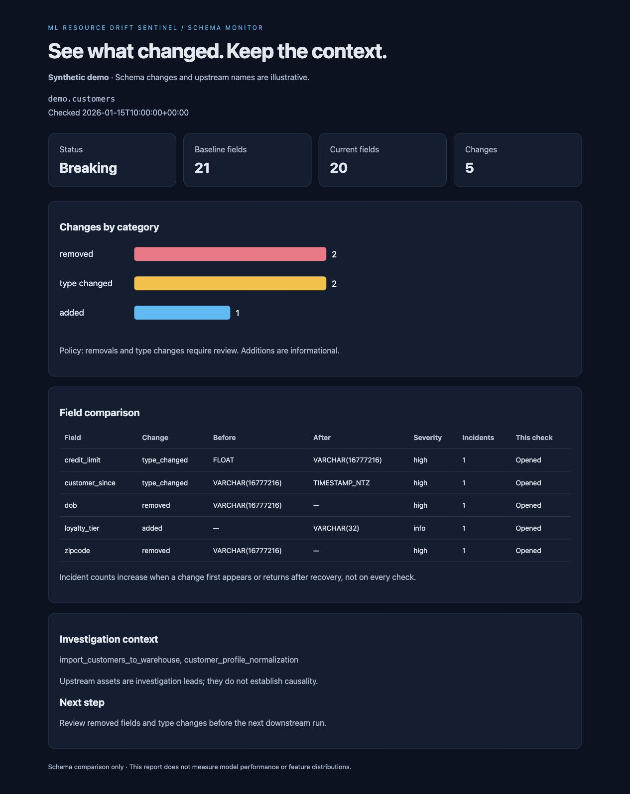
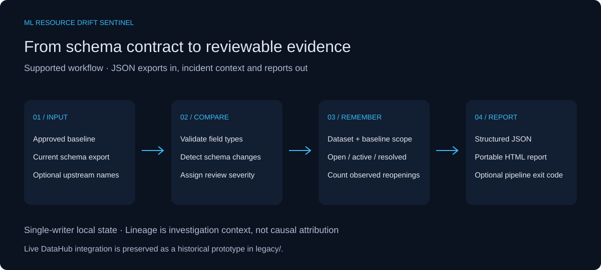
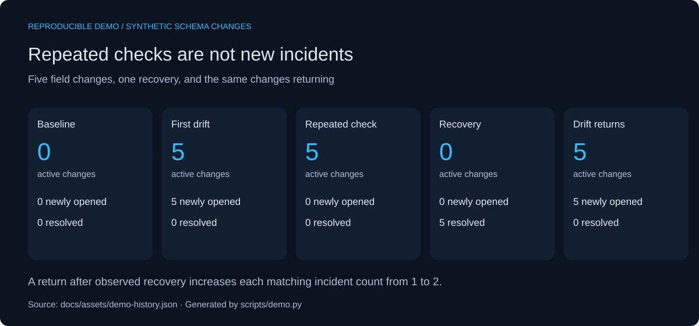

# ML Resource Drift Sentinel

A small Python tool for checking whether a dataset's schema still matches its approved baseline. It records incident history and produces a report that makes the changes easy to inspect.



## The problem

A downstream pipeline can depend on a column that disappears or changes type without warning. The change may be small in the source table and still break a feature transformation later.

This project focuses on that boundary: compare the current schema with a known baseline, show the affected fields, and keep enough history to distinguish an ongoing issue from one that has returned.

## Try it

You need Python 3.11 or later. The offline demo uses only the standard library; no Docker, credentials, or external services are required.

```bash
python scripts/demo.py
```

Open `docs/assets/demo-report.html` in your browser. The report uses synthetic changes to a customer-table schema. Upstream names are illustrative; no customer records are included.

To run a fresh check yourself:

```bash
python -m sentinel check   --baseline examples/baseline.json   --schema examples/current.json   --dataset demo.customers   --lineage examples/upstreams.json
```

Open `reports/latest.html` for the visual report, or read `reports/latest.json` for the structured result. Repeat the command to see the same active incidents without increasing their counts.

## What it checks

| Change | Default severity | Reason |
| --- | --- | --- |
| Removed field | High | A consumer may still require the field. |
| Changed type | High | Existing transformations may no longer accept the values. |
| Added field | Informational | Usually compatible, but strict contracts may require review. |

Type strings are compared after trimming outer whitespace and normalizing case. The tool does not infer whether a conversion is safe or whether two database-specific types are equivalent.

## How it works



The comparison engine is independent of the CLI and report renderer. Incident memory is scoped to both the dataset identifier and the baseline. A change opens an incident when it first appears. Checking it again leaves the count unchanged. If it disappears and later returns, the count increases.



These are fixture results, not production measurements. The demo opens five incidents, repeats the check, observes recovery, and introduces the same changes again. Regenerate the JSON and HTML evidence with `python scripts/demo.py`, then rebuild the SVG figures with `python scripts/figures.py`.

## Create a baseline

Schema files are JSON objects mapping field paths to native type strings:

```json
{"customer_id": "NUMBER(38,0)", "credit_limit": "FLOAT"}
```

```bash
python -m sentinel snapshot   --schema examples/baseline.json   --baseline .sentinel/approved.json
```

Existing baseline files require `--overwrite`. Review the proposed schema before replacing an approved baseline: accepting a change makes it the new reference and starts a new incident-history scope.

## Use it in a pipeline

Add `--fail-on-breaking` to return exit code `2` when removals or type changes are present. Exit code `1` means invalid input or a processing error; successful checks otherwise return `0`.

```bash
python -m sentinel check   --baseline examples/baseline.json   --schema examples/current.json   --dataset demo.customers   --fail-on-breaking
```

The demo above deliberately returns `2`. Reports and state are still written.

## Project layout

```text
sentinel/          Comparison engine, CLI, and HTML renderer
examples/          Baseline, synthetic current schema, and illustrative lineage
scripts/demo.py    Deterministic incident-lifecycle demo
tests/            Unit and CLI integration tests
docs/             Design notes, figures, and sample reports
 legacy/           Original DataHub MCP prototype, preserved for reference
```

## Tests

```bash
python -m unittest discover -s tests -v
```

The test suite covers additions, removals, type changes, recurrence, baseline isolation, invalid input, HTML escaping, exit codes, and baseline overwrite protection. GitHub Actions is configured to run it on Python 3.11, 3.12, and 3.13.

## DataHub background

The initial prototype fetched schema and lineage through DataHub's MCP server and appended findings to a dataset description. This version keeps that prototype in `legacy/` while making the comparison workflow reproducible without a live service.

The supported CLI consumes JSON exports. Live MCP polling and metadata write-back are not integrated into the new core yet. The [integration notes](docs/DATAHUB.md) explain the boundary and deployment considerations.

## Limits and next steps

This tool detects schema changes. It does not measure feature distributions, model accuracy, or causal relationships. Upstream lineage offers places to investigate; the presence or absence of an upstream asset does not establish where a change originated.

The default severity policy is deliberately conservative. Incident counts are observed reopenings, not independent production failures. Local state assumes one writer; atomic replacement prevents partial JSON files but does not coordinate concurrent processes. JSON, HTML, and state outputs are separate writes, not one transaction. Use separate state paths for independent jobs.

Useful next steps are a tested DataHub adapter, configurable field contracts, compatibility-aware type rules, and shared incident storage for scheduled checks.

## License

Apache 2.0. The original license is preserved in [LICENSE](LICENSE).
